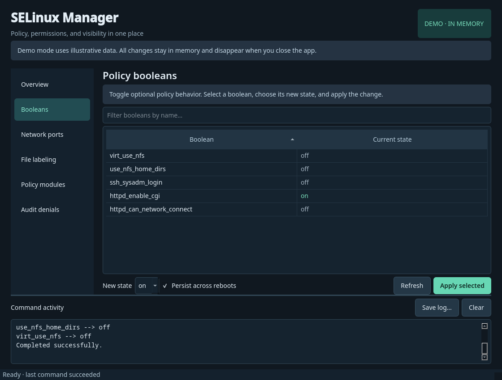
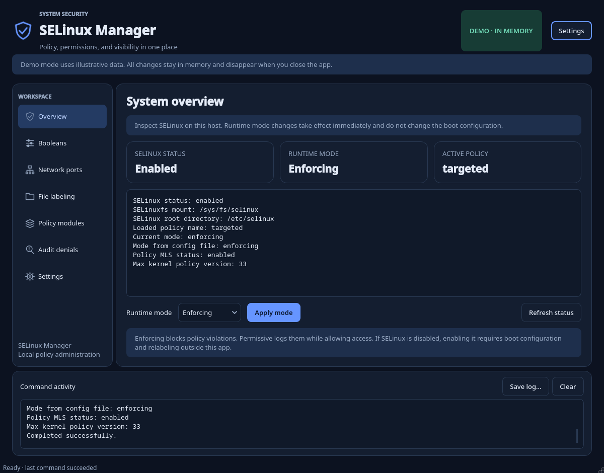

# SELinux Manager

A desktop app for everyday SELinux administration, built with Python and PyQt6. Check your system's status, adjust policy settings, and investigate access denials from one window.



## Getting started

You'll need **Python 3.10 or newer**. For live management, you'll also need a Linux desktop with SELinux already configured and the system tools listed below.

### 1. Set up the Python environment

Open a terminal in the application directory and run:

```bash
python3 -m venv .venv
source .venv/bin/activate
python -m pip install -r requirements.txt
```

### 2. Try the demo

```bash
python app.py --demo
```

Demo mode lets you explore the interface without installing SELinux tools or changing your system. It uses sample data, and any changes disappear when you close the app. It demonstrates the workflow rather than simulating a complete SELinux policy.

### 3. Manage your system

Install the system tools for your distribution, then launch the app:

**Fedora / RHEL**

```bash
sudo dnf install policycoreutils policycoreutils-python-utils libselinux-utils audit polkit
```

**Debian / Ubuntu**, with SELinux already configured:

```bash
sudo apt install policycoreutils policycoreutils-python-utils selinux-utils auditd pkexec
```

```bash
python app.py
```

Run the app as your regular user. When an operation needs administrator access, it uses `pkexec` to request authentication through your desktop's PolicyKit agent. A graphical authentication agent must be running; the app doesn't collect or store passwords.

## What you can do

| Page | Available actions |
| --- | --- |
| **Overview** | View SELinux status and switch between enforcing and permissive mode. |
| **Booleans** | Search policy booleans and apply temporary or persistent changes. |
| **Network ports** | Search port mappings and add, modify, or delete local customizations. |
| **File labeling** | Manage persistent context rules by path pattern and file type. Preview or restore labels on a filesystem path, including subdirectories if needed. |
| **Policy modules** | List installed modules, install a trusted `.pp` or `.cil` file, or remove a module at priority 400. |
| **Audit denials** | Read AVC and USER_AVC events from today, the last ten minutes, or since boot. |
| **Settings** | Choose Light, Dark, or Follow system appearance. |

Before applying a change, the app shows the command and asks you to confirm it. The activity log records commands and results, and you can save it to a file.

### Choose your theme

Open **Settings** from the sidebar or the button at the top of the window. Your choice takes effect immediately and is saved for the next launch.

- **Follow system** is the default. The app follows your desktop's light or dark preference and updates while it is running.
- **Light** uses bright surfaces and blue accents.
- **Dark** uses darker surfaces with softer contrast.

System mode listens to Qt's theme notifications and the Linux desktop settings portal. If neither reports a preference, it uses the palette detected at startup. Explicit Light or Dark settings stay in effect when the desktop theme changes. Native desktop file dialogs may follow the desktop's own theme.



### Which changes survive a reboot?

- **Runtime enforcement mode** lasts until reboot and leaves the boot configuration unchanged.
- **Boolean changes** can be temporary or persistent. Use the *Persist across reboots* checkbox to choose.
- **Port mappings, file context rules, and installed modules** persist across reboots.

### File context rules and labels

Saving a file context rule defines how matching paths should be labeled. It doesn't change the labels on existing files.

After saving a rule, enter an actual filesystem path in the restore field. Use **Preview labels** to inspect the proposed changes, then **Restore labels** to apply them. Path patterns belong in the rule field; the restore field takes a real path.

### Module priorities

Module installation and removal use the default priority, **400**. The module list can include modules installed at other priorities, so removing one at priority 400 may fail or reveal a lower-priority version. Check the command result and refresh the list afterward.

## Troubleshooting

### “Permission denied” when reading the policy store

Ports, file contexts, and modules are read with administrator access automatically. Audit queries also request authentication. Status and runtime boolean reads run as your regular user.

If a protected operation fails, check that your desktop's PolicyKit authentication agent is running and that authentication completed successfully. Access still depends on your system's PolicyKit configuration.

### “SELinux policy is not managed or store cannot be accessed”

If this message remains after successful authentication, inspect the host's SELinux configuration:

```bash
sestatus
```

Check that the reported policy matches an installed distribution policy package and has an accessible, managed store. Administrator access alone won't create a missing policy store or configure SELinux on the host.

The error dialog includes troubleshooting guidance, and the activity log keeps the original command output. The app leaves store permissions unchanged.

### A command is missing

Install the system packages from the setup section. If you're just exploring the interface, launch with `--demo`; it works without SELinux tools.

### The app won't close during an operation

The app waits for the active command to finish before allowing another policy operation or closing. Commands run in the background so the window stays responsive, and policy transactions aren't interrupted by a timeout.

### Follow system doesn't pick up a desktop theme change

First, check that **Follow system** is selected in Settings. The desktop needs to expose its appearance preference through Qt's platform integration or the XDG desktop portal's Settings interface. Settings shows when no desktop preference is available; you can choose Light or Dark directly in that case.

## Scope and implementation

This app manages an existing SELinux setup. Enabling SELinux on a disabled system, changing boot configuration, managing SELinux users and logins, and generating policy from denials are outside its scope.

Commands are launched with argument lists rather than through a shell. The app validates names, ports, and paths, and looks for executables in standard system directories. The SELinux tools perform policy-type and PCRE-pattern validation.

Displayed output is limited to **8 MB per stream**. The activity log retains **3,000 lines**, and log exports include those retained lines.

## Running the tests

From the application directory, with your Python environment active:

```bash
python -m unittest discover -s tests -v
```

To run without a display server:

```bash
QT_QPA_PLATFORM=offscreen python -m unittest discover -s tests -v
```

Backend tests work without Qt; GUI tests are skipped if PyQt6 isn't installed. The tests use sample data and temporary child processes and don't change SELinux settings. They cover command construction, parsing, input validation, privilege routing, navigation, filtering, cancellation, and process errors. Appearance tests use temporary preference files and simulated Qt and desktop-portal events to check theme switching, persistence, and fallbacks.

## Further reading

- [SELinux project](https://github.com/SELinuxProject/selinux)
- [Port mapping commands](https://github.com/SELinuxProject/selinux/blob/master/python/semanage/semanage-port.8)
- [File context commands](https://github.com/SELinuxProject/selinux/blob/master/python/semanage/semanage-fcontext.8)
- [Boolean commands](https://github.com/SELinuxProject/selinux/blob/master/policycoreutils/setsebool/setsebool.8)
- [Audit queries with ausearch](https://github.com/linux-audit/audit-userspace/blob/master/docs/ausearch.8) — the app uses `--input-logs` to read the configured audit logs.
- [Qt QProcess](https://doc.qt.io/qt-6/qprocess.html) — used to run commands asynchronously.
- [Qt color-scheme notifications](https://doc.qt.io/qt-6/qstylehints.html#colorScheme-prop) and [desktop portal settings](https://github.com/flatpak/xdg-desktop-portal/blob/main/data/org.freedesktop.portal.Settings.xml) — used to follow the system theme.

PyQt6 is available under GPL or commercial licensing. Review its license if you plan to distribute the app.
